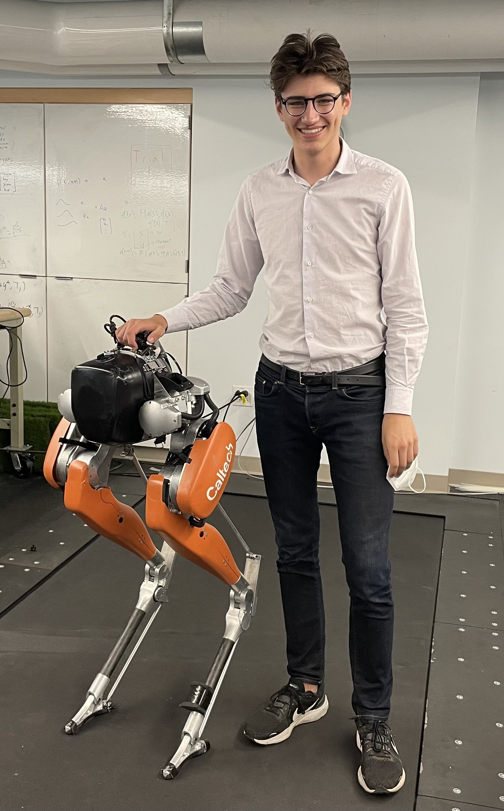
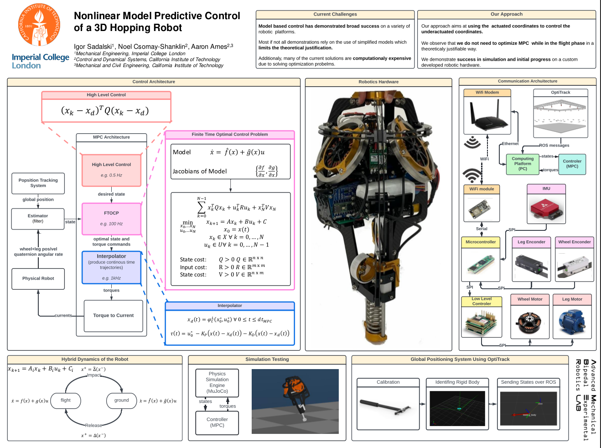
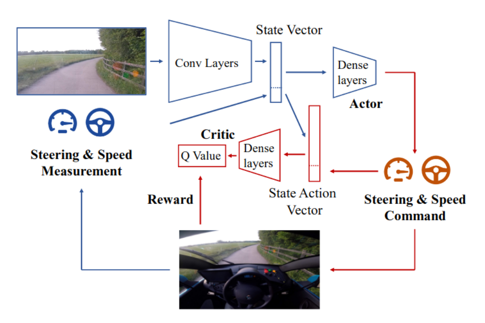
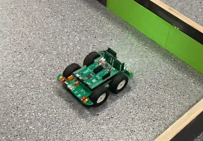
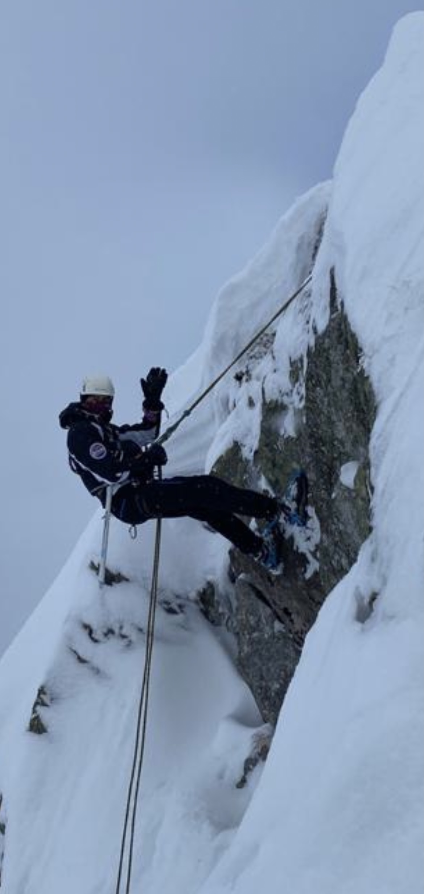

#  Igor Sadalski - Nice to meet you!

  

## About Me
I am a prospective PhD student with a keen interest in **data-driven
control techniques for legged locomotion** and autonomous driving. Specifically, I am passionate
about developing **hybrid model predictive control and reinforcement learning methods for safety-aware
online planning of adaptive locomotion**.

BEng Mechanical Engineering @ Imperial College London  
MSc Computing AI and ML @ Imperial College London
Robotics Researcher @ Caltech 2023
Robotics Researcher @ Caltech 2022

contact: igor.sadalski@gmail.com

## Portfolio
Below you may find some of my projects:

### Caltech Research Placement: "Nonlinear Model Predictive Control of a 3D hopping robot"

I was selected for a full scholarship in Advanced Mechanical Bipedal Experimental Robotics Lab working on Model
Predictive Control for a custom developed robotic hardware under Prof. Aaron Ames, part of the SURF program. Here is a poster detailing my work [surf poster](https://github.com/igor-sadalski/igor-sadalski/blob/main/Igor_Sadalski_Poster_SURF_2022_Nonlinear_Model_Predictive_Control_Hopper.pdf)
as well as low-level driver for the hardware [low level code](https://github.com/igor-sadalski/Hopper_Hardware) and MPC implementation, [MPC code](https://github.com/noelc-s/ARCHER_hopper), where I helped senior PhD Caltech student Noel Csomay-Shanklin.

  

For my work I was mentioned in acknoledgements of paper: *Csomay-Shanklin, N., Dorobantu, V.D. and Ames, A.D., 2022. Nonlinear Model Predictive Control of a 3D Hopping Robot: Leveraging Lie Group Integrators for Dynamically Stable Behaviors. arXiv preprint arXiv:2209.11808.*

### Literature Review: "Aplication of Reinforcement Learning for Autonomous Driving"
Based on nearly 70+ papers from leading journals like ICRA, NeurIPs, CoRL, IROS, etc. I created a comphrehnsive work on state of the art RL lagorithms for autonomous driving [literature review](https://github.com/igor-sadalski/igor-sadalski/blob/main/Application-of-RL-for-AVs-2.pdf).

  

 
### Maze Navigation 
As a part of a course on embeded programing in C with a partner from scratch (implementing our own drivers for motors, color drivers, I2C communication) we developed a small robot navigating a maze based on color cards with [code maze navigation](https://github.com/igor-sadalski/Maze_Navigation).

  

### Engineering Drawings
Both by passion and by training I love design and manufacturing. Here are some engineering drawings: my [hand sketches](https://github.com/igor-sadalski/igor-sadalski/blob/main/hand_drawing.pdf), [assembly drawings](https://github.com/igor-sadalski/igor-sadalski/blob/main/01848914-Assembly-1.pdf), [detailed drawings](https://github.com/igor-sadalski/igor-sadalski/blob/main/01848914-Detail-1.pdf).

## Technologies 
* Linux OS, bash scripting, UNIX commands, VIM, I3
* C++/C - STL, Make, CMake, Eigen, Pinocchio
* Embeded programing: I2C, SPI, LCD displays, PWM for motor control, light sensors
* Python - NumPy, Matplotlib, SciPy, Pandas, Seaborn
* Arduino, MuJoCo, URDF, ROS I, Gazebo, socket programming with UDP TCP/IP protocols, OptiTrack
* Matlab, Simulink, Solidworks, Fusion 360, Visual Studio Code, CLion, Git & GitHub

## Have a nice day!

  

